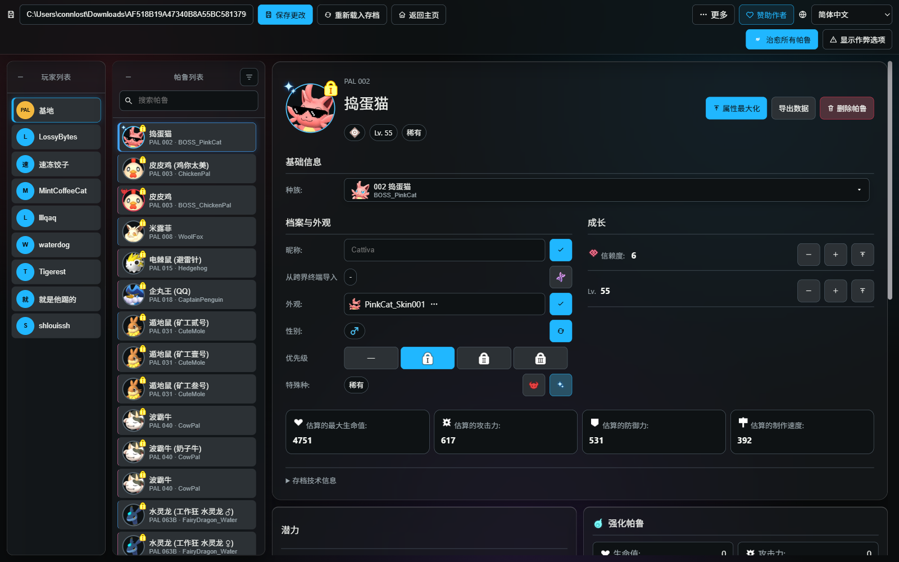
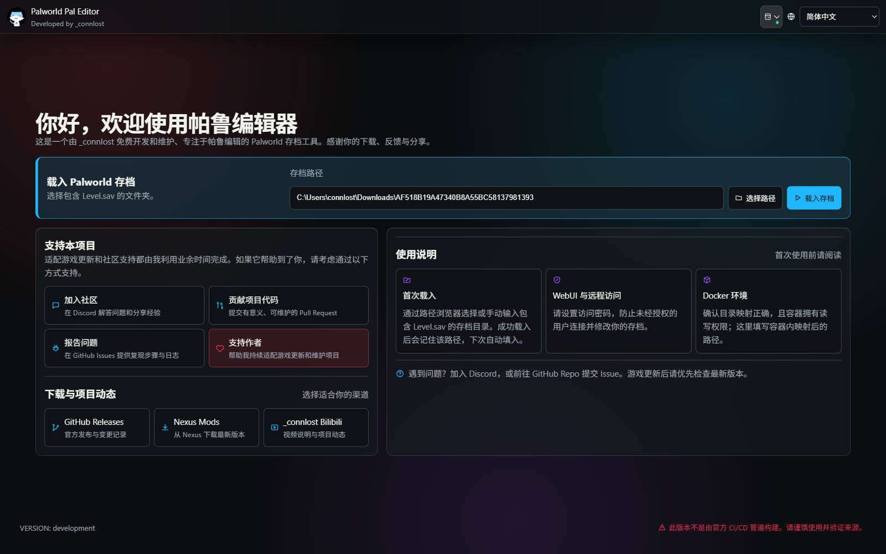
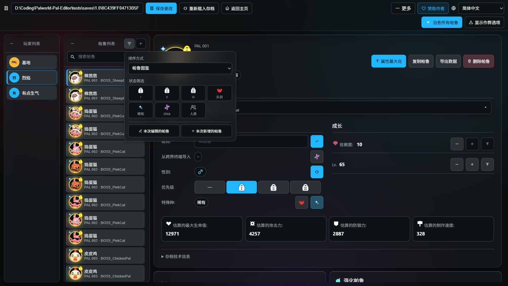
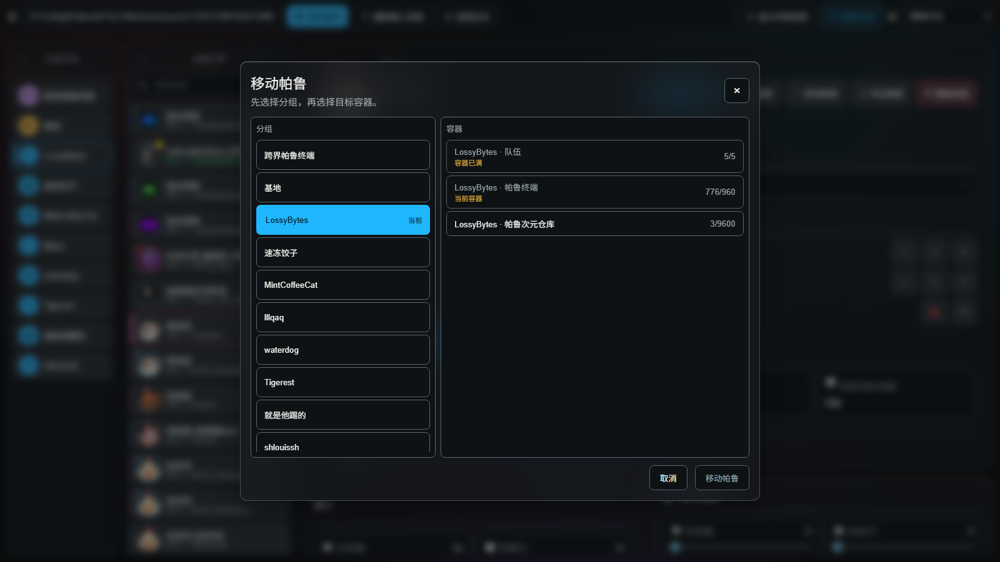
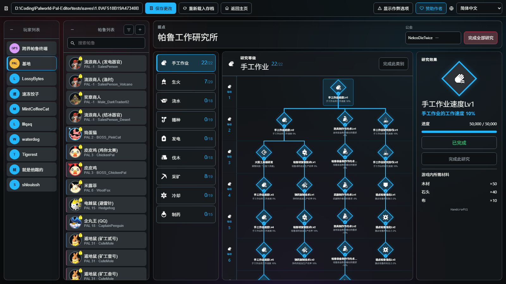
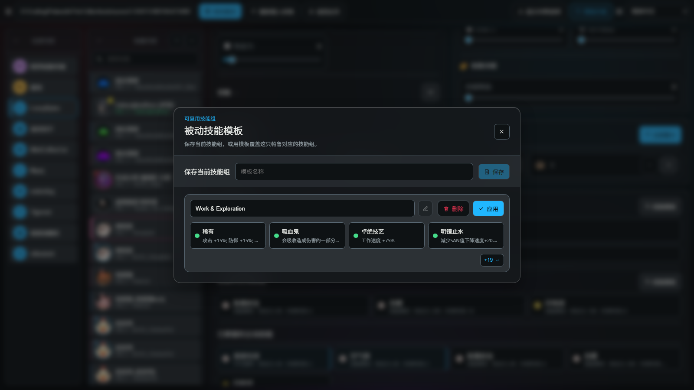
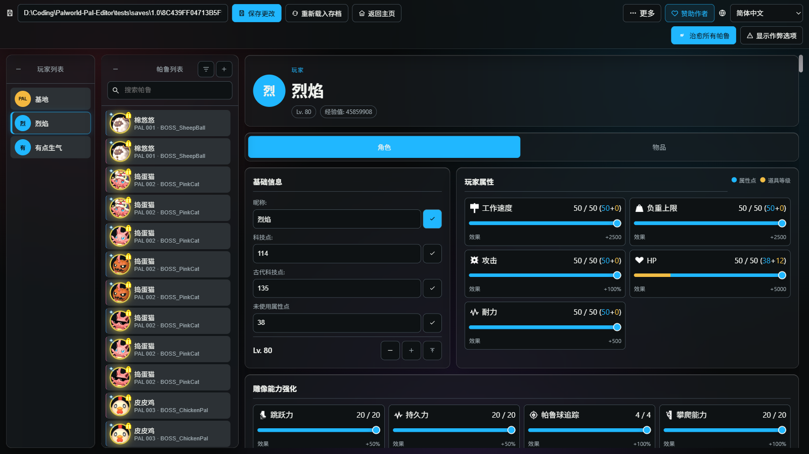
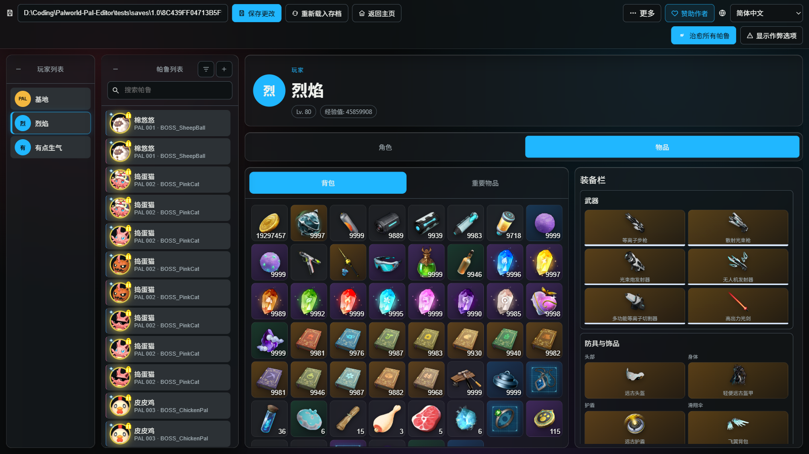

# Palworld Pal Editor

<p align="center">
  <a href="./README.md">English</a> · <strong>简体中文</strong>
</p>

<p align="center">
  <a href="https://github.com/KrisCris/Palworld-Pal-Editor/stargazers"></a>
  <a href="https://github.com/KrisCris/Palworld-Pal-Editor/releases/latest"></a>
  <a href="https://github.com/KrisCris/Palworld-Pal-Editor/releases"></a>
  <a href="./LICENSE"></a>
</p>
<p align="center">
  <a href="https://ko-fi.com/connlost"></a>
  <a href="https://www.paypal.com/paypalme/c0nnlost?country.x=US&locale.x=en_US"></a>
  <a href="https://github.com/KrisCris/Palworld-Pal-Editor/assets/38860226/78d85efd-3a3f-4007-a8a3-4c7ada0cfc5b"></a>
  <a href="https://github.com/user-attachments/assets/8dcbb43f-1270-49fd-b621-db70d2833de5"></a>
  <a href="#支持本项目"></a>
</p>


<p align="center">
  功能丰富的《幻兽帕鲁》存档修改器，支持玩家、帕鲁、帕鲁存放、基地、科技、背包等内容，并可通过桌面 GUI、WebUI、CLI 或 Docker 运行。
</p>



<a href="https://star-history.dera.page/#KrisCris/Palworld-Pal-Editor&type=Date"></a>&nbsp;

> [!CAUTION]
> 修改前请备份存档。修改器会自动创建备份，但仍建议你另外保留一份副本。

> [!WARNING]
> 本软件开源免费。如果你从任何平台付费购买了此工具，请立即退款。请仅通过本仓库或官方构建的修改器内嵌链接支持作者。

## 目录

- [项目简介](#项目简介)
- [下载](#下载)
- [快速开始](#快速开始)
- [功能](#功能)
  - [通用](#通用)
  - [帕鲁](#帕鲁)
  - [帕鲁存放与转移](#帕鲁存放与转移)
  - [基地与公会研究](#基地与公会研究)
  - [模板与批量操作](#模板与批量操作)
  - [玩家](#玩家)
  - [物品栏](#物品栏)
- [安装与运行](#安装与运行)
- [命令行参数](#命令行参数)
- [视频教程](#视频教程)
- [支持本项目](#支持本项目)
- [参与贡献](#参与贡献)
- [鸣谢](#鸣谢)
- [许可证](#许可证)

## 项目简介

**由 \_connlost 用 ❤️ 开发的《幻兽帕鲁》帕鲁修改器。**

Palworld Pal Editor 是一个功能丰富的存档修改器，支持修改玩家、帕鲁、帕鲁存放、基地研究、科技、背包等存档内容，并可通过桌面 GUI、WebUI、CLI 或 Docker 容器运行。

> [!NOTE]
> Steam 存档根目录：`%LOCALAPPDATA%\Pal\Saved\SaveGames`
>
> 存档目录：`%LOCALAPPDATA%\Pal\Saved\SaveGames\<Steam ID>\<存档 ID>`
>
> 请在修改器中选择包含 `Level.sav` 的文件夹。
>
> 修改器目前支持 Steam 格式存档。可使用 [PalworldSaveTools](https://github.com/deafdudecomputers/PalworldSaveTools/releases) 在 Xbox Game Pass 与 Steam 存档之间转换。请先备份存档；游戏更新后，转换功能可能暂时不兼容。

Palworld Pal Editor 完整支持 Deutsch、English、Español、Español (México)、Français、Bahasa Indonesia、Italiano、日本語、한국어、Polski、Português (Brasil)、Русский、ไทย、Türkçe、Tiếng Việt、简体中文和繁體中文。

## 下载

- [GitHub Releases](https://github.com/KrisCris/Palworld-Pal-Editor/releases) — 正式版本与更新记录
- [Nexus Mods](https://www.nexusmods.com/palworld/mods/995) — 从 Nexus 下载最新正式版
- [Nightly Release](https://github.com/KrisCris/Palworld-Pal-Editor/releases/tag/auto-nightly-buiilds) — 自动更新的开发测试版本

建议普通用户直接下载打包好的桌面应用，无需另外安装 Python。

## 快速开始

1. 备份需要修改的存档文件夹。
2. 启动桌面应用。
3. 选择包含 `Level.sav` 的文件夹，然后点击 **载入存档**。
4. 选择玩家、基地或帕鲁并进行修改。
5. 点击 **保存更改**，然后进入游戏确认结果。



## 功能

### 通用



- [x] 列出玩家及其帕鲁
- [x] 搜索帕鲁
- [x] 对帕鲁排序
- [x] 筛选帕鲁
- [x] 显示不在常规容器中的帕鲁
- [x] 通过作弊模式启用通常不可用的选项
- [x] 在作弊模式下显示技能与帕鲁的内部名称

### 帕鲁


- [x] 修改帕鲁种族
- [x] 切换头目帕鲁
- [x] 切换稀有帕鲁
- [x] 支持修改游戏内无法正常获得的：塔主、突袭、狂暴、油田、首领连战形态
- [x] 修改帕鲁昵称
- [x] 修改帕鲁性别
- [x] 修改帕鲁外观
- [x] 修改帕鲁优先级
- [x] 查看和切换跨界终端导入（DNA）状态
- [x] 修改帕鲁等级
- [x] 修改信赖度
- [x] 修改潜力
- [x] 修改觉醒
- [x] 修改帕鲁强化
- [x] 修改浓缩等级
- [x] 修改工作适应性
- [x] 修改装备的主动技能
- [x] 修改学会的主动技能
- [x] 修改被动技能，并区分帕鲁被动、普通被动与伙伴技能
- [x] 治愈和复活帕鲁
- [x] 治愈所有帕鲁
- [x] 在合法范围内最大化帕鲁属性
- [x] 删除帕鲁

### 帕鲁存放与转移



- [x] 浏览存档中的所有容器：队伍、帕鲁终端、基地、观赏笼、帕鲁次元仓库与跨界帕鲁终端
- [x] 将帕鲁移动到任意玩家、基地或存放处的容器
- [x] 修改和复制存放在帕鲁次元仓库或跨界帕鲁终端中的帕鲁
- [x] 处理跨界帕鲁终端中已被占用的槽位：覆盖原有帕鲁，或直接跳转到该帕鲁
- [x] 在指定的目标容器中直接创建帕鲁

### 基地与公会研究



- [x] 修改基地中工作的帕鲁
- [x] 修改公会的帕鲁工作研究所
- [x] 完成单项研究、整个类别，或一次完成全部研究
- [x] 在包含多个公会的存档中切换公会
- [x] 研究名称、效果与所需材料均取自游戏数据

### 模板与批量操作



- [x] 创建主动技能模板
- [x] 创建被动技能模板
- [x] 创建可重复使用的帕鲁模板
- [x] 添加帕鲁
- [x] 复制帕鲁
- [x] 从 JSON 导入帕鲁
- [x] 将帕鲁导出为 JSON

### 玩家



- [x] 修改玩家昵称
- [x] 修改玩家等级
- [x] 修改玩家属性
    - [x] 生命值
    - [x] 耐力
    - [x] 攻击
    - [x] 负重上限
    - [x] 工作速度
- [x] 修改未使用属性点
- [x] 修改雕像能力强化
    - [x] 捕获力
    - [x] 耐饿能力
    - [x] 游泳能力
    - [x] 食物保存
    - [x] 跳跃力
    - [x] 滑翔能力
    - [x] 攀爬能力
    - [x] 异常状态抵抗
    - [x] 持久力
    - [x] 帕鲁球追踪
    - [x] 经验值获取
    - [x] 虹彩之运
    - [x] 移动速度
- [x] 修改科技点
- [x] 修改古代科技点
- [x] 切换普通与古代科技解锁状态
- [x] 一键解锁所有科技

### 物品栏



- [x] 修改背包物品
- [x] 修改重要物品
- [x] 修改武器
- [x] 修改防具
- [x] 修改盾牌
- [x] 修改滑翔伞
- [x] 修改饰品
- [x] 修改帕鲁球模块
- [x] 修改装备的食物
- [x] 修改物品数量
- [x] 将磨损的物品恢复到满耐久与满弹药
- [x] 清空物品栏槽位

## 安装与运行

### 桌面应用

下载正式版本，解压后运行可执行文件。如果内置窗口无法正常工作，可以在现代浏览器中打开程序显示的 WebUI 地址。

### Docker

1. 下载仓库中的 [`sample-docker-compose.yml`](./docker/sample-docker-compose.yml)，并保存为 `docker-compose.yml`。
2. 修改 `docker-compose.yml` 中的以下配置：
   - 在 `ports` 中，将 `8080:58888` 左侧的 `8080` 改成需要使用的主机端口；右侧容器端口 `58888` 保持不变。
   - 在 `volumes` 中，将 `/Host/Path/To/The/GameSave/AF518B19A47340B8A55BC58137981393` 替换为包含 `Level.sav` 的存档目录；右侧 `/mnt/gamesave` 保持不变。
   - 将默认 `PASSWORD` 替换为强密码。还可以修改 `APP_LANG`；在 Linux 上，可将 `PUID`/`PGID` 改为主机用户的 UID/GID。
3. 在 Compose 文件所在目录运行 `docker compose up -d`。

示例配置会将修改器映射到 `http://localhost:8080`。只要服务器能被其他设备访问，就强烈建议设置密码。

### 从源码运行

安装 Python 3.11+ 和 Node.js，克隆本仓库，然后运行：

```powershell
.\setup_and_run.ps1
```

在 Linux 或 macOS 上运行：

```bash
./setup_and_run.sh
```

脚本会安装仓库锁定的依赖、构建 WebUI 并启动修改器。项目已不再发布 PyPI 构建。

### WebUI 与远程访问

以 Web 模式启动并设置密码：

```powershell
palworld-pal-editor.exe --mode web --port 58080 --password "请设置强密码"
```

使用独立部署的前端时，请通过入口页面右上角的服务器菜单选择后端。

WebUI 是一个渐进式网页应用（PWA）：浏览器可以将它安装到桌面或主屏幕，界面与帕鲁图片也会在多次运行之间保留缓存。

## 命令行参数

```text
--lang LANG          界面语言
--path PATH          存档文件夹路径
--mode MODE          cli、gui 或 web
--port PORT          WebUI 端口
--password PASSWORD  WebUI 访问密码
--debug              仅供开发使用的调试模式
--nocli              在 GUI/WebUI 模式中禁用交互式 CLI
```

运行 `palworld-pal-editor.exe --help` 可查看当前参数。命令行参数会覆盖 `config.json`；通常不需要手动编辑该文件。设置、已保存的模板与日志存放在系统的用户数据目录中。

## 视频教程

- [Bilibili：Palworld Pal Editor 1.0 功能展示](https://www.bilibili.com/video/BV1j4M26UEim/?share_source=copy_web&vd_source=fe2d6c1e59f6c8d600d221e1800972f5)
- [YouTube：旧版功能展示](https://www.youtube.com/watch?v=PhSWpr0f70g)
- [旧版 WebUI/GUI 教程](https://github.com/KrisCris/Palworld-Pal-Editor/assets/38860226/66f3cb1e-f1fc-401e-b8a1-987ac3e6b02d)
- [旧版 Docker 教程](https://github.com/KrisCris/Palworld-Pal-Editor/assets/38860226/d7008b22-a2ff-4a2c-8903-32bab0922b32)

只有 1.0 功能展示对应当前修改器；其他视频仅保留为旧版操作流程参考。

## 支持本项目

<p align="center">
  <a href="https://ko-fi.com/connlost"></a>
  <a href="https://www.paypal.com/paypalme/c0nnlost?country.x=US&locale.x=en_US"></a>
  <a href="https://github.com/KrisCris/Palworld-Pal-Editor/assets/38860226/78d85efd-3a3f-4007-a8a3-4c7ada0cfc5b"></a>
  <a href="https://github.com/user-attachments/assets/8dcbb43f-1270-49fd-b621-db70d2833de5"></a>
</p>

本项目由 _connlost 利用业余时间开发和维护。

- [加入 Discord 社区](https://discord.gg/FnuA95nMJ8)，提问或帮助其他用户。
- 在 [GitHub Issues](https://github.com/KrisCris/Palworld-Pal-Editor/issues) 报告可复现的问题，并附上可以安全分享的日志和存档信息。
- 通过 Pull Request 贡献目标明确、便于维护的修复。
- 通过 [Ko-fi](https://ko-fi.com/connlost)、[PayPal](https://www.paypal.com/paypalme/c0nnlost?country.x=US&locale.x=en_US)、[支付宝](https://github.com/KrisCris/Palworld-Pal-Editor/assets/38860226/78d85efd-3a3f-4007-a8a3-4c7ada0cfc5b) 或 [微信支付](https://github.com/user-attachments/assets/8dcbb43f-1270-49fd-b621-db70d2833de5) 支持后续维护。

## 参与贡献

提交问题或功能请求前，请先搜索现有 [Issues](https://github.com/KrisCris/Palworld-Pal-Editor/issues)。贡献代码时，请基于最新开发分支、保持每个 Pull Request 目标单一、说明用户可见的变化，并为界面修改提供截图。

## 鸣谢

- [Take-Me1010](https://github.com/Take-Me1010) — 日语翻译
- [MagicBear](https://github.com/magicbear) — 快速载入存档的方法
- [palworld-save-tools](https://github.com/KrisCris/palworld-save-tools) — 《幻兽帕鲁》存档序列化
- [Palworld Server Toolkit](https://github.com/magicbear/palworld-server-toolkit) — 项目早期参考

## 许可证

Palworld Pal Editor 使用 [GNU General Public License v3.0](./LICENSE) 发布。
