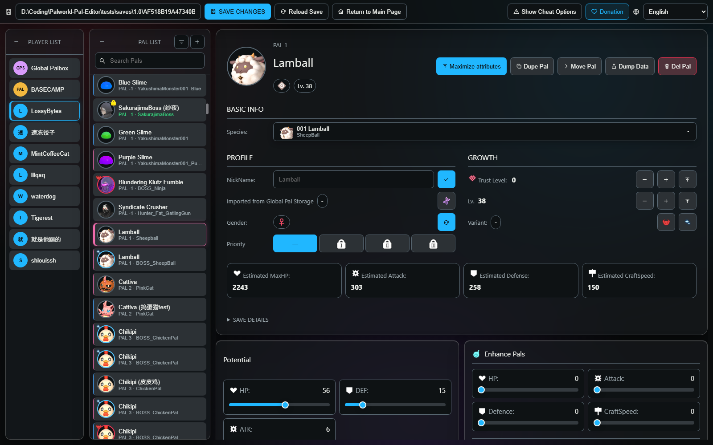
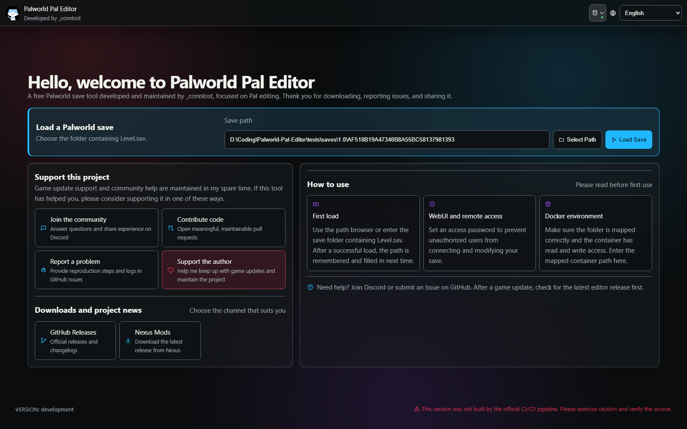
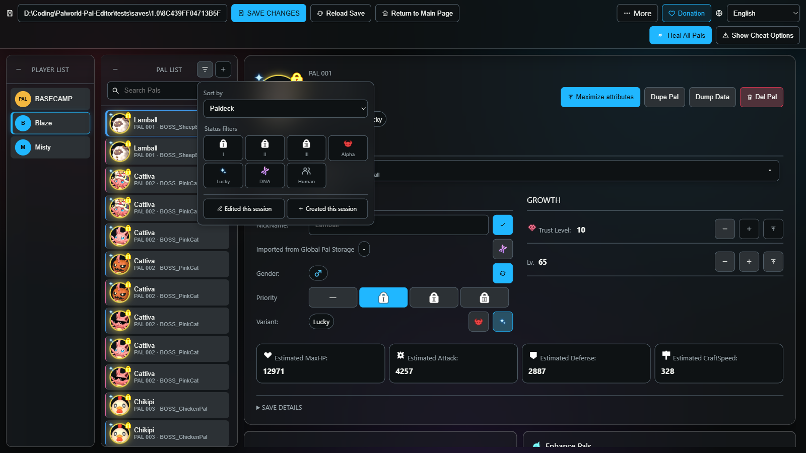
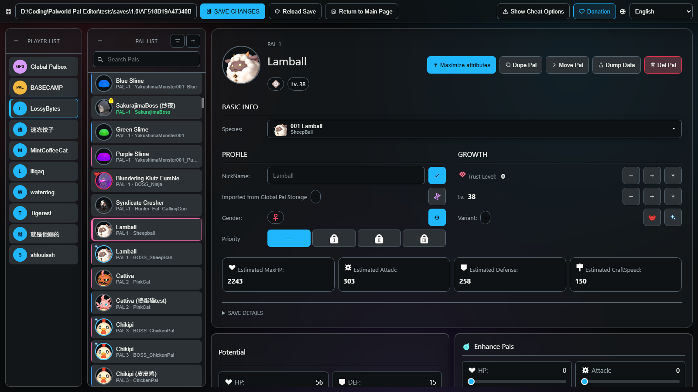
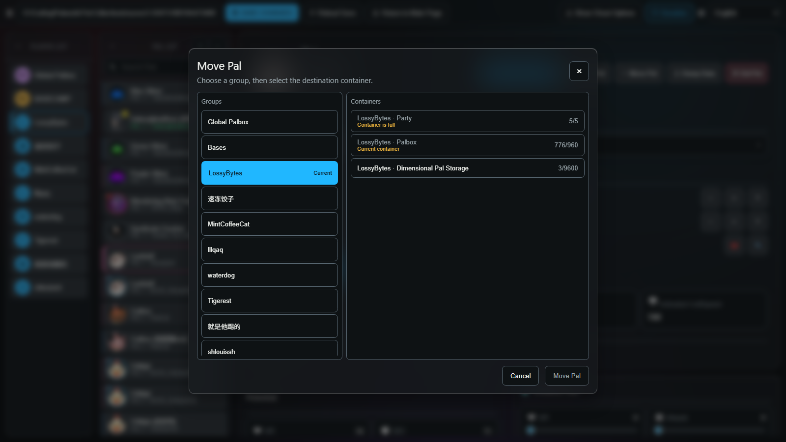
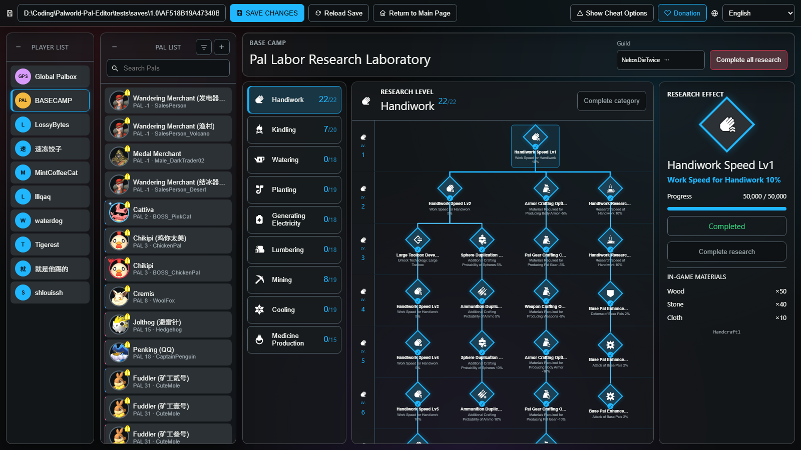
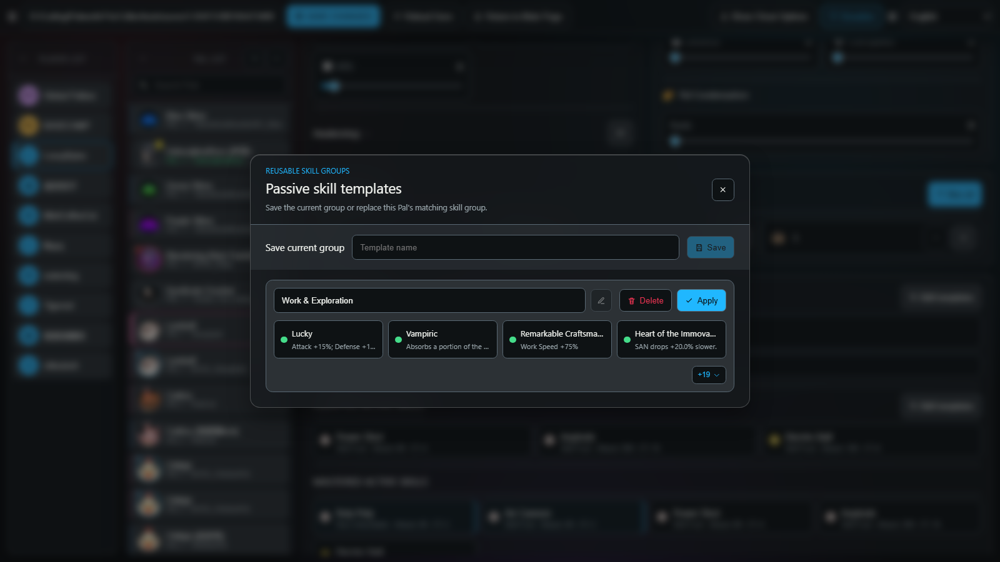
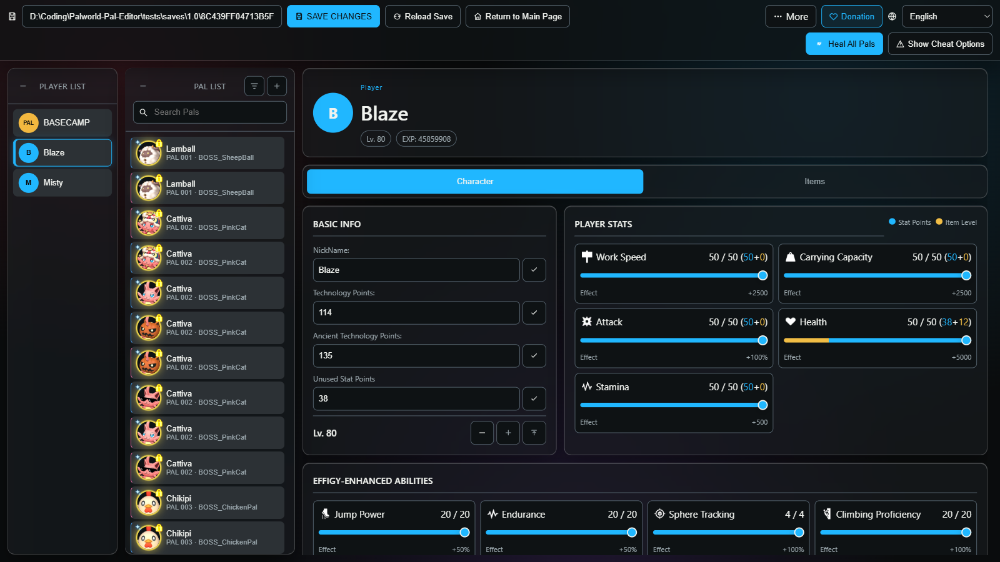
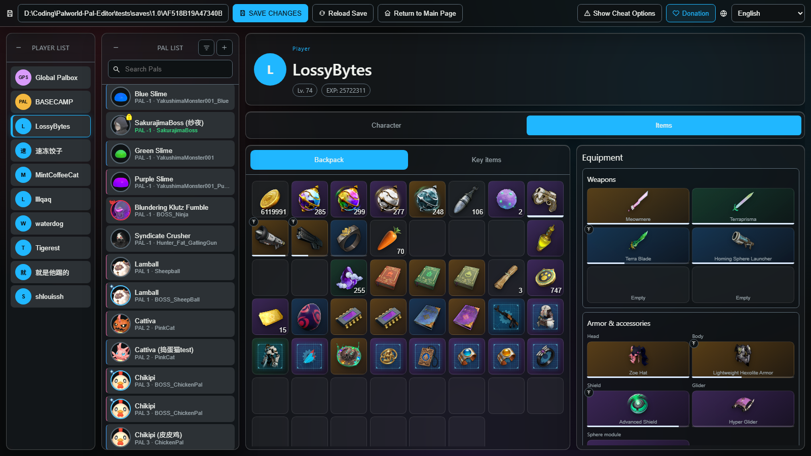

# Palworld Pal Editor

<p align="center">
  <strong>English</strong> · <a href="./README.cn.md">简体中文</a>
</p>

<p align="center">
  <a href="https://github.com/KrisCris/Palworld-Pal-Editor/stargazers"></a>
  <a href="https://github.com/KrisCris/Palworld-Pal-Editor/releases/latest"></a>
  <a href="https://github.com/KrisCris/Palworld-Pal-Editor/releases"></a>
  <a href="./LICENSE"></a>
</p>
<p align="center">
  <a href="https://ko-fi.com/connlost"></a>
  <a href="https://www.paypal.com/paypalme/c0nnlost?country.x=US&locale.x=en_US"></a>
  <a href="https://github.com/KrisCris/Palworld-Pal-Editor/assets/38860226/78d85efd-3a3f-4007-a8a3-4c7ada0cfc5b"></a>
  <a href="https://github.com/user-attachments/assets/8dcbb43f-1270-49fd-b621-db70d2833de5"></a>
  <a href="#supporting-this-Project"></a>
</p>


<p align="center">
  A feature-rich Palworld save editor for players, Pals, Pal storage, base camps, Technology, inventories, and more — available as a desktop GUI, WebUI, CLI, and Docker container.
</p>



> [!CAUTION]
> Back up your save before editing it. The editor creates backups, but you should keep your own copy as well.

> [!WARNING]
> This software is free and open source. If you paid for it on another platform, request a refund. Support the author only through this repository or links embedded in official builds of the editor.

## Table of Contents

- [Overview](#overview)
- [Download](#download)
- [Quick Start](#quick-start)
- [Features](#features)
  - [General](#general)
  - [Pals](#pals)
  - [Pal storage and transfers](#pal-storage-and-transfers)
  - [Base camp and guild research](#base-camp-and-guild-research)
  - [Templates and bulk operations](#templates-and-bulk-operations)
  - [Players](#players)
  - [Inventory](#inventory)
- [Installation and Running](#installation-and-running)
- [Command-line Options](#command-line-options)
- [Guides](#guides)
- [Supporting this Project](#supporting-this-project)
- [Contributing](#contributing)
- [Credits](#credits)
- [License](#license)

## Overview

**A Palworld Pal Editor developed by \_connlost with ❤️.**

Palworld Pal Editor is a feature-rich save editor that supports player, Pal, Pal storage, base-camp research, Technology, inventory, and other save modifications. Run it as a desktop GUI, WebUI, CLI, or Docker container.

> [!NOTE]
> Steam save root: `%LOCALAPPDATA%\Pal\Saved\SaveGames`
>
> Save folder: `%LOCALAPPDATA%\Pal\Saved\SaveGames\<Steam ID>\<Save ID>`
>
> Select the folder that contains `Level.sav`.
>
> The editor currently supports Steam-format saves. Use [PalworldSaveTools](https://github.com/deafdudecomputers/PalworldSaveTools/releases) to convert between Xbox Game Pass and Steam saves. Always back up your saves first; conversion compatibility may lag behind game updates.

Palworld Pal Editor fully supports Deutsch, English, Español, Español (México), Français, Bahasa Indonesia, Italiano, 日本語, 한국어, Polski, Português (Brasil), Русский, ไทย, Türkçe, Tiếng Việt, 简体中文, and 繁體中文.

## Download

- [GitHub Releases](https://github.com/KrisCris/Palworld-Pal-Editor/releases) — official releases and changelogs
- [Nexus Mods](https://www.nexusmods.com/palworld/mods/995) — download the latest release from Nexus
- [Nightly Release](https://github.com/KrisCris/Palworld-Pal-Editor/releases/tag/auto-nightly-buiilds) — automatically updated development builds

For most users, the pre-built desktop application is recommended. It does not require a separate Python installation.

## Quick Start

1. Back up the save folder you want to edit.
2. Start the desktop application.
3. Choose the folder containing `Level.sav`, then select **Load Save**.
4. Select a player, base camp, or Pal and make your changes.
5. Select **Save Changes**, then verify the result in game.



## Features

### General



- [x] List players and their Pals
- [x] Search Pals
- [x] Sort Pals
- [x] Filter Pals
- [x] Show Pals outside their normal containers
- [x] Enable normally unavailable options through cheat mode
- [x] Show skill and Pal internal names in cheat mode

### Pals



- [x] Edit Pal species
- [x] Toggle Alpha Pal
- [x] Toggle Lucky Pal
- [x] Supports modifying the following forms that cannot be obtained normally in the game: Tower, Raid, Predator, Oil Rig, and Boss Rush variants.
- [x] Edit Pal nickname
- [x] Edit Pal gender
- [x] Edit Pal skin
- [x] Edit Pal priority
- [x] View and toggle Global Pal Storage import (DNA) status
- [x] Edit Pal level
- [x] Edit Trust level
- [x] Edit Potential
- [x] Edit Awakening
- [x] Edit Soul upgrades
- [x] Edit condensation rank
- [x] Edit work suitability
- [x] Edit equipped active skills
- [x] Edit learned active skills
- [x] Edit passive skills, listed separately as Pal, regular, and Partner skills
- [x] Heal and revive Pals
- [x] Heal all Pals
- [x] Maximize Pal progression within legal limits
- [x] Delete Pals

### Pal storage and transfers



- [x] Browse every container a save has: party, Palbox, base camp, viewing cage, Dimensional Pal Storage, and Global Pal Storage
- [x] Move a Pal to any container of any player, base camp, or storage
- [x] Edit and clone Pals that live in Dimensional Pal Storage or Global Pal Storage
- [x] Resolve a Global Pal Storage slot that is already taken, by overwriting it or by jumping to the Pal holding it
- [x] Create a Pal directly in a chosen destination container

### Base camp and guild research



- [x] Edit the base camp's worker Pals
- [x] Edit the guild's Pal Labor Research Laboratory
- [x] Complete a single research node, a whole category, or every category at once
- [x] Switch between guilds in a save that holds more than one
- [x] Read research names, effects, and material costs from the game's own data

### Templates and bulk operations



- [x] Create active-skill templates
- [x] Create passive-skill templates
- [x] Create reusable Pal templates
- [x] Add Pals
- [x] Clone Pals
- [x] Import Pals from JSON
- [x] Export Pals to JSON

### Players



- [x] Edit player name
- [x] Edit player level
- [x] Edit player stats
    - [x] Health
    - [x] Stamina
    - [x] Attack
    - [x] Carrying Capacity
    - [x] Work Speed
- [x] Edit unused Stat Points
- [x] Edit Pal Effigy abilities
    - [x] Capture Power
    - [x] Satiety Duration
    - [x] Swimming Ability
    - [x] Food Preservation
    - [x] Jump Power
    - [x] Flight Capacity
    - [x] Climbing Proficiency
    - [x] Status Resistance
    - [x] Endurance
    - [x] Sphere Tracking
    - [x] EXP Gain
    - [x] Rainbow Fortune
    - [x] Movement Speed
- [x] Edit Technology Points
- [x] Edit Ancient Technology Points
- [x] Toggle normal and Ancient Technology unlocks
- [x] Unlock all Technology

### Inventory



- [x] Edit backpack items
- [x] Edit key items
- [x] Edit weapons
- [x] Edit armor
- [x] Edit shields
- [x] Edit gliders
- [x] Edit accessories
- [x] Edit Pal Sphere modules
- [x] Edit equipped food
- [x] Edit item quantities
- [x] Restore a worn item to full durability and a full magazine
- [x] Clear inventory slots

## Installation and Running

### Desktop Application

Download a release, extract it, and run the executable. If the embedded window does not work on your system, open the displayed WebUI address in a modern browser.

### Docker

1. Download [`sample-docker-compose.yml`](./docker/sample-docker-compose.yml) and save it as `docker-compose.yml`.
2. Edit these values in `docker-compose.yml`:
   - In `ports`, change the left side of `8080:58888` to the host port you want. Keep container port `58888` unchanged.
   - In `volumes`, replace `/Host/Path/To/The/GameSave/AF518B19A47340B8A55BC58137981393` with the save folder containing `Level.sav`. Keep `/mnt/gamesave` unchanged.
   - Replace the default `PASSWORD` with a strong password. You may also change `APP_LANG` and, on Linux, `PUID`/`PGID` to match the host user.
3. In the directory containing the Compose file, run `docker compose up -d`.

The sample maps the editor to `http://localhost:8080`. A password is strongly recommended whenever the server is reachable by another device.

### Run from Source

Install Python 3.11+ and Node.js, clone the repository, then run:

```powershell
.\setup_and_run.ps1
```

On Linux or macOS:

```bash
./setup_and_run.sh
```

The setup scripts install the repository's pinned dependencies, build the WebUI, and start the editor. PyPI builds are no longer published.

### WebUI and Remote Access

Start the editor in web mode and set a password:

```powershell
palworld-pal-editor.exe --mode web --port 58080 --password "choose-a-strong-password"
```

When using a separately hosted frontend, choose the backend from the server menu at the top-right of the entry page.

The WebUI is a progressive web app: a browser can install it to the desktop or home screen, and it keeps its interface and Pal images cached between runs.

## Command-line Options

```text
--lang LANG          Interface language
--path PATH          Save-folder path
--mode MODE          cli, gui, or web
--port PORT          WebUI port
--password PASSWORD  WebUI access password
--debug              Development-only debug mode
--nocli              Disable the interactive CLI in GUI/WebUI mode
```

Run `palworld-pal-editor.exe --help` for the current list. Command-line values override `config.json`; the application manages that file automatically. Settings, saved templates, and logs are kept in the platform's user data directory.

## Guides

- [Palworld Pal Editor 1.0 showcase on Bilibili](https://www.bilibili.com/video/BV1j4M26UEim/?share_source=copy_web&vd_source=fe2d6c1e59f6c8d600d221e1800972f5)
- [Older showcase on YouTube](https://www.youtube.com/watch?v=PhSWpr0f70g)
- [Older WebUI/GUI guide](https://github.com/KrisCris/Palworld-Pal-Editor/assets/38860226/66f3cb1e-f1fc-401e-b8a1-987ac3e6b02d)
- [Older Docker guide](https://github.com/KrisCris/Palworld-Pal-Editor/assets/38860226/d7008b22-a2ff-4a2c-8903-32bab0922b32)

Only the 1.0 showcase reflects the current editor. The other videos are kept as older workflow references.

## Supporting this Project

<p align="center">
  <a href="https://ko-fi.com/connlost"></a>
  <a href="https://www.paypal.com/paypalme/c0nnlost?country.x=US&locale.x=en_US"></a>
  <a href="https://github.com/KrisCris/Palworld-Pal-Editor/assets/38860226/78d85efd-3a3f-4007-a8a3-4c7ada0cfc5b"></a>
  <a href="https://github.com/user-attachments/assets/8dcbb43f-1270-49fd-b621-db70d2833de5"></a>
</p>

This project is developed and maintained by _connlost in spare time.

- [Join the Discord community](https://discord.gg/FnuA95nMJ8) to ask questions and help other users.
- [Report reproducible bugs](https://github.com/KrisCris/Palworld-Pal-Editor/issues) with logs and save details that are safe to share.
- Contribute focused, maintainable fixes through pull requests.
- Support continued maintenance through [Ko-fi](https://ko-fi.com/connlost), [PayPal](https://www.paypal.com/paypalme/c0nnlost?country.x=US&locale.x=en_US), [AliPay](https://github.com/KrisCris/Palworld-Pal-Editor/assets/38860226/78d85efd-3a3f-4007-a8a3-4c7ada0cfc5b), or [WeChat Pay](https://github.com/user-attachments/assets/8dcbb43f-1270-49fd-b621-db70d2833de5).

## Contributing

Search existing [issues](https://github.com/KrisCris/Palworld-Pal-Editor/issues) before opening a report or request. For code changes, work from the latest development branch, keep each pull request focused, explain user-visible behavior, and include screenshots for interface changes.

## Credits

- [Take-Me1010](https://github.com/Take-Me1010) — Japanese translation
- [MagicBear](https://github.com/magicbear) — fast save-loading approach
- [palworld-save-tools](https://github.com/KrisCris/palworld-save-tools) — Palworld save serialization
- [Palworld Server Toolkit](https://github.com/magicbear/palworld-server-toolkit) — early project reference

## License

Palworld Pal Editor is released under the [GNU General Public License v3.0](./LICENSE).
